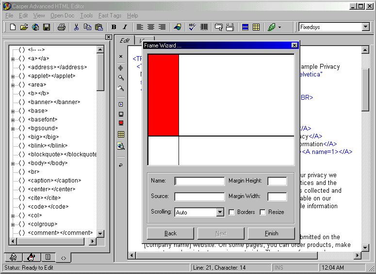



## Advanced Casper HTML Editor 3\.0

### Description

Casper HTML Editor 3.0 basic description:

Please note: This program is by no means finished. I have finished the

basics functions and tools and now I'll be fixing some bugs, improving the

code and etc.

The next version should be much more stable and not so resource-eating.

<> Important <>

Since I have used one OCX please make sure you've registered it before opening

this project. The OCX is a Folder TreeView by CCRP (http://www.mvps.org/ccrp/)

It's a free OCX under GPL Agreement so don't worry.

Some of the tools included:

* Meta Tag Wizard

* Table Wizard

* Frame Wizard

* Color Chooser

* Tag Chooser

* Image Map Tool

* Character Set Tool

* Document Weight Calculation

Some of the Functions Included:

* Snippets Library for Java and HTML

* Complete Set of HTML 4.0 Standard tags

* Real Time tag Editor

* Real Time Preview

* Line Numbering in Gutter

* Find / Replace Dialog

* Syntax Coloring (as type / new line)

* Open Document From WWW

* Templates

* HTML to Text File Conversion

* 10 x Width Word Wrap (customizable)

and more ....

Above mentioned tools and functions are a subject to improve and/or change.

Just so you know .......
 
### More Info
 

             |
---                |---
**Submitted On**   |2000-08-17 00:09:30
**By**             |[Vladimir S\. Pekulas](https://github.com/Planet-Source-Code/PSCIndex/blob/master/ByAuthor/vladimir-s-pekulas.md)
**Level**          |Advanced
**User Rating**    |4.9 (127 globes from 26 users)
**Compatibility**  |VB 6\.0
**Category**       |[Complete Applications](https://github.com/Planet-Source-Code/PSCIndex/blob/master/ByCategory/complete-applications__1-27.md)
**World**          |[Visual Basic](https://github.com/Planet-Source-Code/PSCIndex/blob/master/ByWorld/visual-basic.md)
**Archive File**   |[CODE\_UPLOAD90248172000\.zip](https://github.com/Planet-Source-Code/vladimir-s-pekulas-advanced-casper-html-editor-3-0__1-10740/archive/master.zip)

